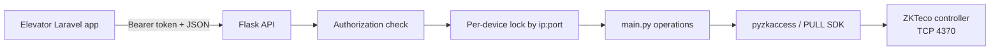
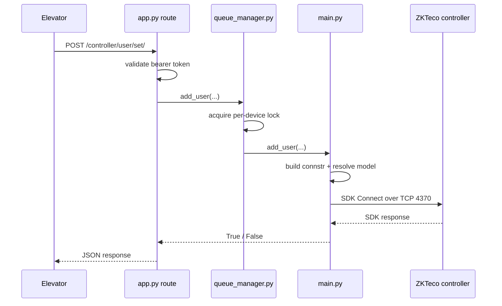
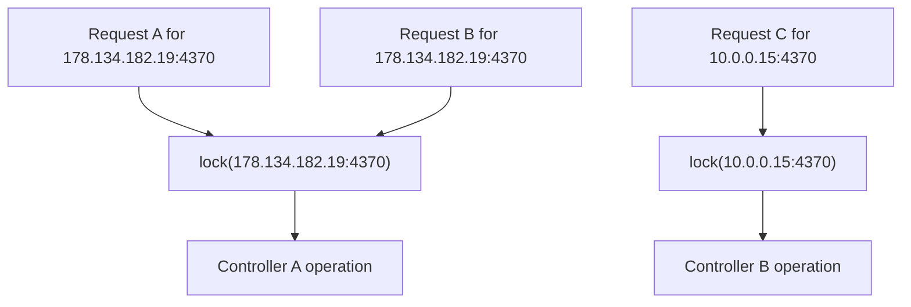

# ZKT Access Flask Bridge

Small Flask service that sits between the Laravel `Elevator` app and ZKTeco access controllers. It exposes a minimal HTTP API, serializes operations per device, and uses `pyzkaccess` plus the vendor PULL SDK to talk to controllers over `TCP/4370`.

## Overview

This service exists so Laravel can treat controller operations as authenticated HTTP requests instead of loading the ZKTeco SDK directly. The typical caller is `Elevator`'s `TagService`, which sends `/controller/user/set/`, `/controller/user/remove/`, and `/controller/users/` requests with the target controller IP, port, model, and credentials.

## Architecture



### Request Flow



## Locking and Concurrency

Operations are serialized per controller using an `RLock` keyed by `ip:port`. Different devices can be processed in parallel, but the same device is protected from concurrent writes and reads.



There is also a separate `output_lock` used only to serialize writes to `output.txt`.

## Environment

```env
ZKTECO_SHARED_SECRET=shared_secret_used_by_laravel
```

## Installation

```bash
pip install -r requirements.txt
```

## Running Locally

```bash
export ZKTECO_SHARED_SECRET=change-me
flask --app app run --host 0.0.0.0 --port 5000
```

## API

### `POST /ping/`

Checks whether the host responds to ICMP ping.

Request body:

```json
{
  "ip": "178.134.182.19"
}
```

### `POST /controller/user/set/`

Adds or updates a user on a controller.

Request body:

```json
{
  "ip": "178.134.182.19",
  "port": 4370,
  "card": "2686267595",
  "pin": "99291",
  "model": "C3-200",
  "doors": [1, 2]
}
```

### `POST /controller/user/remove/`

Removes a user from a controller.

### `POST /controller/users/`

Reads users from a controller.

### `POST /controller/restart/`

Sends the controller restart command. This endpoint requires the shared Bearer
token and uses the same per-device lock as user operations.

Request body:

```json
{
  "ip": "178.134.182.19",
  "port": 4370,
  "model": "C3-200"
}
```

The restart route requires:

```http
Authorization: Bearer <ZKTECO_SHARED_SECRET>
```

### `POST /controller/health/`

Opens and closes a real ZKTeco SDK connection. This is the preferred health
check because ICMP ping can succeed while the controller service is unavailable.
The endpoint requires the same shared Bearer token as the restart route.

## What `-307` Means

In this project, `-307` comes from the vendor SDK path used by `pyzkaccess` when `Connect()` fails. In `pyzkaccess`, the error string maps to:

- `-307`: `Connection attempt failed`

That is useful confirmation, but it does not by itself tell you why the connect failed.

## Why Ping Can Succeed While Connect Fails

`ping3.ping(ip)` only checks ICMP reachability. The SDK connection is a different network path: it tries to open a TCP session to the controller on port `4370`.

So this log pattern is possible and common:

1. Controller responds to ping.
2. SDK connect to `TCP/4370` times out or is rejected.
3. Code logs the failed SDK connect and then logs a successful ping.

That means the host is reachable, not that the controller service is reachable.

Common causes:

- Firewall or security group allows ICMP but blocks `TCP/4370`.
- NAT or port forwarding is wrong.
- Controller is powered on but the SDK service is not listening.
- Wrong controller mode or wrong model mapping.
- Timeout is too aggressive for the network path.

## `-307` Troubleshooting Checklist

Run these checks from the Flask host, not from your laptop:

```bash
ping -c 2 178.134.182.19
nc -vz -w 5 178.134.182.19 4370
```

Interpretation:

- Ping succeeds and `nc` times out: the box is reachable, but `TCP/4370` is not.
- Ping fails and `nc` fails: broader network path issue.
- Ping succeeds and `nc` connects: the problem is more likely controller mode, password, model, or SDK state.

Windows equivalent:

```powershell
Test-NetConnection 178.134.182.19 -Port 4370
```

## Logging Note

`ping3.ping()` returns seconds by default. If a log line says:

```text
Ping successful. Round-trip time: 0.0937 ms
```

that value is actually about `93.7 ms`, not `0.0937 ms`. The current log message labels the units incorrectly.

## Related Project

The Laravel app that calls this service lives in `../Elevator`. Its README describes the higher-level architecture and how the bridge fits into `TagService`.
