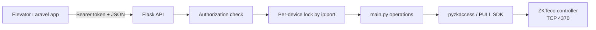
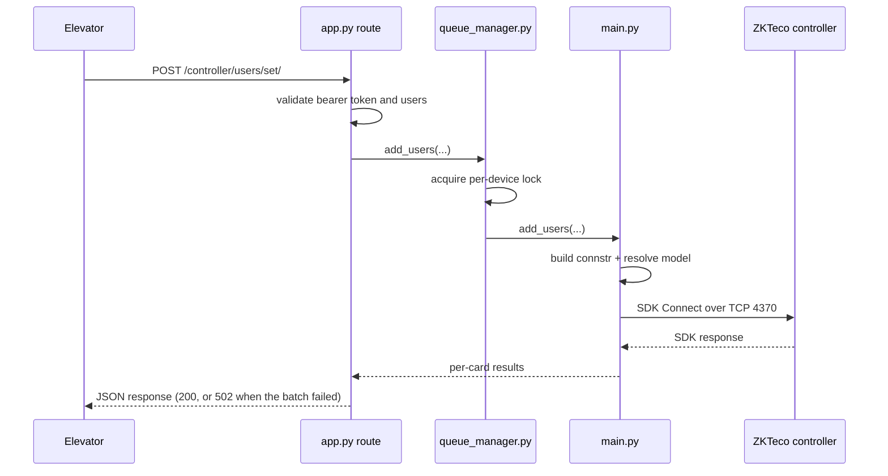
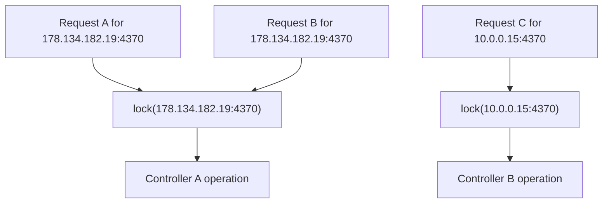

# ZKT Access Flask Bridge

Small Flask service that sits between the Laravel `Elevator` app and ZKTeco access controllers. It exposes a minimal HTTP API, serializes operations per device, and uses `pyzkaccess` plus the vendor PULL SDK to talk to controllers over `TCP/4370`.

## Overview

This service exists so Laravel can treat controller operations as authenticated HTTP requests instead of loading the ZKTeco SDK directly. The caller is `Elevator`'s `ZktecoBridge` client: tag writes go to `/controller/users/set/` and `/controller/users/remove/` in batches, one request per controller, with the target controller IP, port and model in each body.

## Architecture


```mermaid
flowchart LR
    Laravel["Elevator Laravel app"] -->|"Bearer token + JSON"| Flask["Flask API"]
    Flask --> Auth["Authorization check"]
    Auth --> Locks["Per-device lock by ip:port"]
    Locks --> Main["main.py operations"]
    Main --> SDK["pyzkaccess / PULL SDK"]
    SDK --> Controller["ZKTeco controller\nTCP 4370"]
```

### Request Flow


```mermaid
sequenceDiagram
    participant L as Elevator
    participant A as app.py route
    participant Q as queue_manager.py
    participant M as main.py
    participant Z as ZKTeco controller

    L->>A: POST /controller/users/set/
    A->>A: validate bearer token and users
    A->>Q: add_users(...)
    Q->>Q: acquire per-device lock
    Q->>M: add_users(...)
    M->>M: build connstr + resolve model
    M->>Z: SDK Connect over TCP 4370
    Z-->>M: SDK response
    M-->>A: per-card results
    A-->>L: JSON response (200, or 502 when the batch failed)
```

## Locking and Concurrency

Operations are serialized per controller using an `RLock` keyed by `ip:port`. Different devices can be processed in parallel, but the same device is protected from concurrent writes and reads.


```mermaid
flowchart TD
    Request1["Request A for 178.134.182.19:4370"] --> Lock1["lock(178.134.182.19:4370)"]
    Request2["Request B for 178.134.182.19:4370"] --> Lock1
    Request3["Request C for 10.0.0.15:4370"] --> Lock2["lock(10.0.0.15:4370)"]
    Lock1 --> Device1["Controller A operation"]
    Lock2 --> Device2["Controller B operation"]
```

There is also a separate `output_lock` used only to serialize writes to `output.txt`.

## Environment

```env
ZKTECO_SHARED_SECRET=shared_secret_used_by_laravel
```

## Installation

```bash
pip install -r requirements.txt
```

## Running Locally

```bash
export ZKTECO_SHARED_SECRET=change-me
flask --app app run --host 0.0.0.0 --port 5000
```

## API

Every controller route answers `401` without the Bearer token, and `422` when
the body is JSON but not an object, or when `ip` is missing.

### `POST /ping/`

Checks whether the host responds to ICMP ping.

Request body:

```json
{
  "ip": "178.134.182.19"
}
```

### `POST /controller/users/set/`

Adds or updates cards on one controller in a single SDK session. `doors` is optional: without it the card opens every door, with it the card opens exactly those doors (1-4). An empty list is rejected.

Request body:

```json
{
  "operation_id": "6f1c…-3",
  "ip": "178.134.182.19",
  "port": 4370,
  "model": "C3-200",
  "users": [
    {"card": "2686267595", "pin": "99291", "doors": [1, 2]},
    {"card": "2686267596", "pin": "99292"}
  ]
}
```

Response (`200` when the batch succeeded, `502` when the SDK could not complete it, `422` for an invalid body):

```json
{
  "success": true,
  "operation_id": "6f1c…-3",
  "total": 2,
  "succeeded": 2,
  "failed": 0,
  "results": [
    {"card": "2686267595", "pin": "99291", "success": true},
    {"card": "2686267596", "pin": "99292", "success": true}
  ]
}
```

### `POST /controller/users/remove/`

Removes cards from one controller, with the same body and response as `/controller/users/set/`. An item that carries `doors` is not removed: the card stays and only its door mask is rewritten to those doors (a turned-off resident who keeps the entrance).

### `POST /controller/users/`

Reads users from a controller.

### `POST /controller/restart/`

Sends the controller restart command. This endpoint requires the shared Bearer
token and uses the same per-device lock as user operations.

Request body:

```json
{
  "ip": "178.134.182.19",
  "port": 4370,
  "model": "C3-200"
}
```

The restart route requires:

```http
Authorization: Bearer <ZKTECO_SHARED_SECRET>
```

### `POST /controller/door/control/`

Switches one door's lock relay, like ZKAccess's Remote Opening and Remote
Closing dialogs. It requires the shared Bearer token and runs under the
per-device lock. It is not retried, because the relay may already have switched.

Request body (`door` is the controller's own door number, 1 to the model's lock
count; `seconds` is required only for `open`):

```json
{
  "ip": "178.134.182.19",
  "port": 4370,
  "model": "C3-400",
  "door": 2,
  "action": "open",
  "seconds": 5
}
```

| `action` | ZKAccess option | `ControlDevice` calls |
|---|---|---|
| `open` | Disable Intraday Passage Mode Time Zone, then Remote Opening, door open time N | `(4, door, 0)`, then `(1, door, 1, seconds)` |
| `hold_open` | Remote Opening, Normal Opening | `(1, door, 1, 255)` |
| `close` | Remote Closing, Disable Intraday Passage Mode Time Zone, then Close door | `(4, door, 0)`, then `(1, door, 1, 0)` |

Output time 255 puts the door in the firmware's normally open state. Output
time 0 alone does not leave that state: on site, ZKAccess "Close door" left a
Normal Opening door open, and only "Disable Intraday Passage Mode Time Zone"
(operation 4, 0) closed it. `open` sends it first for the same reason, so a
timed open after `hold_open` locks again when the seconds run out. A side
effect is that `open` and `close` also suspend a
passage-mode time zone (`DoorNKeepOpenTimeZone`) for the rest of the day; the
Laravel app never sets one.

Responses: `200` when the commands were sent, `422` for invalid input, `502`
when the SDK call failed.

Not yet checked on hardware: whether `open` above 60 s works (the SDK guide says
1-60, the ZKAccess dialog says 1-254), and whether a held door stays open past
midnight or a controller restart.

### `POST /controller/relays/state/`

Reads whether each door's lock relay is on right now. It requires the shared
Bearer token and runs under the per-device lock.

Request body: `ip`, `port`, `model`, optional `timeout` and `password`.

```json
{
  "success": true,
  "relays": [{"door": 1, "on": true}, {"door": 2, "on": false}],
  "changed_at": "2026-10-09 23:07:39"
}
```

`relays` has one entry per lock of the model. `changed_at` is the controller's
clock at the last relay or sensor change on the board, for any door.

It calls `GetRTLogExt` directly (pyzkaccess does not wrap it) and reads the
`type=rtstate` record's `relay` field, one bit per door from the lowest. The
SDK guide says that field is "currently 0", but on the C3-200 boards it follows
every switch (checked 2026-10-09): commands, cards, and a timed open running
out. It is what the firmware drives the relay to, not a reading of the contact.

The controller sends that record only once its realtime event cache is empty,
so the route reads and drops the queued events first (the `Transaction` table
keeps them) and gives up after 10 reads. Two side effects:

- A ZKAccess Real-time Monitoring window on the same controller loses those
  events from its live view.
- Mixing `GetRTLog` and `GetRTLogExt` on one session kept the cache from ever
  emptying, so the route uses only `GetRTLogExt`.

Responses: `200` with the state, `422` without `ip`, `502` when the SDK failed
or no status record came back.

### `POST /controller/health/`

Opens and closes a real ZKTeco SDK connection. This is the preferred health
check because ICMP ping can succeed while the controller service is unavailable.
The endpoint requires the same shared Bearer token as the restart route.

## What `-307` Means

In this project, `-307` comes from the vendor SDK path used by `pyzkaccess` when `Connect()` fails. In `pyzkaccess`, the error string maps to:

- `-307`: `Connection attempt failed`

That is useful confirmation, but it does not by itself tell you why the connect failed.

## Why Ping Can Succeed While Connect Fails

`ping3.ping(ip)` only checks ICMP reachability. The SDK connection is a different network path: it tries to open a TCP session to the controller on port `4370`.

So this log pattern is possible and common:

1. Controller responds to ping.
2. SDK connect to `TCP/4370` times out or is rejected.
3. Code logs the failed SDK connect and then logs a successful ping.

That means the host is reachable, not that the controller service is reachable.

Common causes:

- Firewall or security group allows ICMP but blocks `TCP/4370`.
- NAT or port forwarding is wrong.
- Controller is powered on but the SDK service is not listening.
- Wrong controller mode or wrong model mapping.
- Timeout is too aggressive for the network path.

## `-307` Troubleshooting Checklist

Run these checks from the Flask host, not from your laptop:

```bash
ping -c 2 178.134.182.19
nc -vz -w 5 178.134.182.19 4370
```

Interpretation:

- Ping succeeds and `nc` times out: the box is reachable, but `TCP/4370` is not.
- Ping fails and `nc` fails: broader network path issue.
- Ping succeeds and `nc` connects: the problem is more likely controller mode, password, model, or SDK state.

Windows equivalent:

```powershell
Test-NetConnection 178.134.182.19 -Port 4370
```

## Logging Note

`ping3.ping()` returns seconds by default. If a log line says:

```text
Ping successful. Round-trip time: 0.0937 ms
```

that value is actually about `93.7 ms`, not `0.0937 ms`. The current log message labels the units incorrectly.

## Related Project

The Laravel app that calls this service lives in `../Elevator`. Its README describes the higher-level architecture and how the bridge fits into `TagService`.
